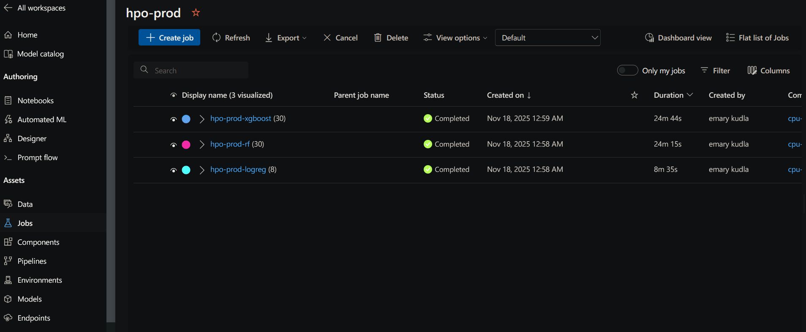
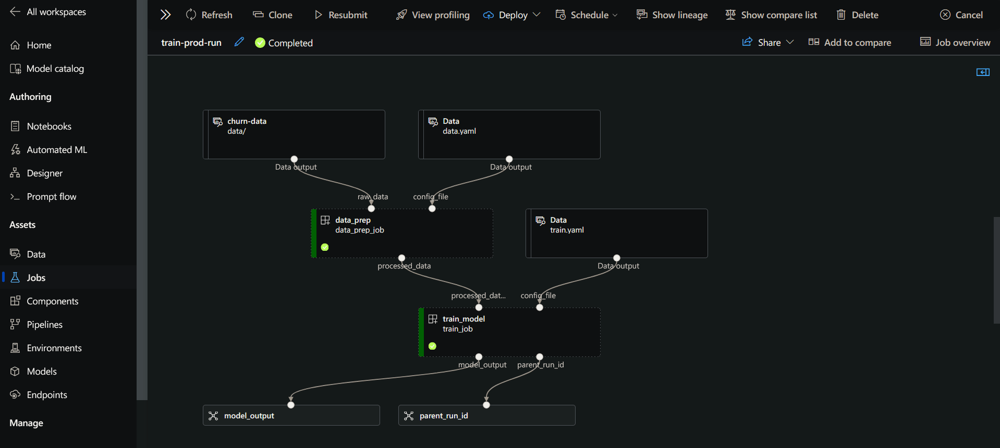
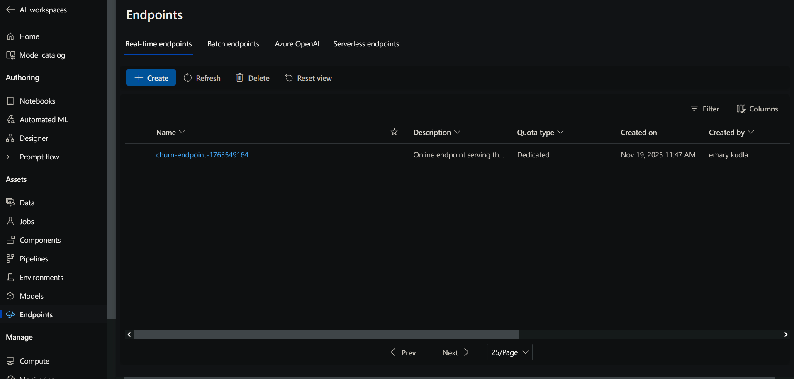

# Bank Customer Churn Prediction with Azure ML

Configuration-driven Azure ML workflow for bank customer churn prediction. Hyperparameter tuning runs from `notebooks/hpo_manual_trials.ipynb` on an Azure ML compute instance; MLflow captures every trial so you can evaluate, promote, and deploy the best model.

---

## Table of Contents

1. [Project Overview](#project-overview)
2. [Key Features](#key-features)
3. [Project Structure](#project-structure)
4. [Exploratory Data Analysis](#exploratory-data-analysis)
5. [Dataset](#dataset)
6. [What's Implemented So Far](#whats-implemented-so-far)
7. [Evaluation Criteria Checklist](#evaluation-criteria-checklist)
8. [Running on Azure ML](#running-on-azure-ml)
9. [Documentation](#documentation)
10. [Docker Usage](#docker-usage)
11. [Tech Stack](#tech-stack)
12. [Project Limitations & Future Work](#project-limitations--future-work)

---

## Project Overview

- **Objective**: Predict whether a bank customer will churn (binary classification) using structured tabular features.
- **Model zoo**: Logistic Regression (`logreg`), Random Forest (`rf`), and XGBoost (`xgboost`) with shared preprocessing and MLflow logging.
- **Optimization path**: Run `notebooks/hpo_manual_trials.ipynb` on an Azure ML compute instance to submit sweeps defined in `configs/hpo.yaml`; the notebook exports the best configuration back into `configs/train.yaml`.
- **Production retraining**: Execute `run_pipeline.py` (or its notebook cell) to run the data prep → train pipeline end to end with the optimized settings, producing both pickle and MLflow artifacts under `outputs/`.
- **Deployment**: `notebooks/deploy_online_endpoint.ipynb` registers the MLflow bundle and deploys it to a managed online endpoint, with `sample-data.json` providing an encoded smoke-test payload.

---

### Key Features

- **HPO** – submit and monitor Azure ML sweeps from `notebooks/hpo_manual_trials.ipynb`.
- **Production retraining pipeline** – `run_pipeline.py` reuses the best config for fast, fixed-hyperparameter runs (data prep → train).
- **Managed online endpoint playbook** – `notebooks/deploy_online_endpoint.ipynb` registers MLflow bundles, deploys, smoke-tests, and cleans up endpoints.
- **Centralized configuration** – `configs/*.yaml` govern data prep, training defaults, MLflow settings, and sweep budgets for every workflow.
- **MLflow-first logging** – each trial/run captures parameters, metrics (F1, ROC-AUC, etc.), signatures, and artifacts for reproducibility.
- **Reproducible environments** – Dockerfile + pinned requirements keeps local, Docker, and Azure ML environments aligned; `aml/environments/environment.yml` mirrors the same image.

---

## Project Structure

```text
.
├── Job_train_job_OutputsAndLogs/      # Downloaded AML job logs & artifacts
├── aml/
│   ├── components/
│   │   ├── data_prep.yaml
│   │   └── train.yaml                 # Regular training component (fixed hyperparameters)
│   └── environments/
│       └── environment.yml            # Azure ML environment definition (Docker image reference)
├── artifacts/
│   └── mlflow_online_model/           # Latest packaged model for endpoint deployments
├── architecture.canvas                # Architecture diagram (VS Code canvas)
├── configs/
│   ├── data.yaml
│   ├── hpo.yaml
│   ├── mlflow.yaml
│   └── train.yaml
├── data/
│   └── README.md
├── docs/
│   ├── MASTER_PLAN.md                 # This file - project plan and guide
│   ├── TROUBLESHOOTING.md             # Troubleshooting guide for common issues
│   ├── dependencies.md
│   ├── pipeline_guide.md
│   ├── python_setup.md
│   └── setup_guide.md
├── logs/
│   └── artifacts/                     # Local copies of AML job logs/artifacts
├── mlruns/                            # Local MLflow tracking store
├── notebooks/
│   ├── deploy_online_endpoint.ipynb   # Managed online endpoint deployment workflow
│   ├── eda.ipynb                      # Exploratory data analysis
│   └── hpo_manual_trials.ipynb        # Manual HPO sweep orchestration in Azure ML
├── outputs/
│   ├── model_output/                  # Latest pipeline output bundle(s)
│   └── xgboost_mlflow/                # Current MLflow model directory
├── sample-data.json                   # Request payload for online endpoint smoke tests
├── setup/
│   ├── create_data_asset.py           # Script to create Azure ML data assets
│   ├── setup.sh                       # Bash script for Azure ML resource setup
│   ├── setup.ps1                      # PowerShell script for Azure ML resource setup
│   └── README.md                      # Setup documentation
├── src/
│   ├── data/                          # Data processing utilities
│   ├── models/                        # Model definitions (logreg, rf, xgboost)
│   ├── training/                      # Training utilities
│   ├── utils/                         # Utility modules
│   │   ├── azure_config.py            # Azure ML configuration loading
│   │   ├── config_loader.py           # YAML configuration loading
│   │   ├── env_loader.py              # Environment variable loading
│   │   ├── mlflow_utils.py            # MLflow integration utilities
│   │   └── ...
│   ├── data_prep.py                   # Data preprocessing script
│   ├── run_sweep_trial.py             # Helper script for HPO sweep trials
│   ├── train.py                       # Model training script
│   └── README.md
├── config.env                         # Environment configuration (not in git)
├── config.env.example                 # Example environment configuration template
├── Dockerfile                         # Docker image definition
├── hpo_utils.py                       # Hyperparameter optimization utilities
├── run_pipeline.py                    # Regular training pipeline orchestration script
├── README.md                          # Project overview
├── requirements.in                    # Core dependencies (source)
├── requirements.txt                   # Core dependencies (pinned)
├── dev-requirements.in                # Development dependencies (source)
├── dev-requirements.txt               # Development dependencies (pinned)
└── venv/                              # Local virtual environment (gitignored)
```

---

## Tech Stack

- **Languages**: Python 3.9 (scripts + notebooks).
- **Data & ML libraries**: pandas, NumPy, scikit-learn, XGBoost, imbalanced-learn.
- **Experiment tracking**: MLflow (local `mlruns/` + Azure ML-backed runs).
- **Orchestration**: Azure ML SDK v2, AML components (`aml/components/*.yaml`), `run_pipeline.py`.
- **Deployment**: Azure ML managed online endpoints using MLflow bundles.
- **Containerization**: Dockerfile (Python 3.9 base) + Azure Container Registry.
- **Dev tooling**: pip/venv, `requirements*.txt`, `dev-requirements*.txt`, VS Code/Jupyter.

---

## Dataset

The project uses the [Bank Customer Churn dataset from Kaggle](https://www.kaggle.com/datasets/mathchi/churn-for-bank-customers), containing **10,000 customer records** with 14 features:

- **Customer identifiers**: `RowNumber`, `CustomerId`, `Surname` (dropped during preprocessing)
- **Demographics**: `Geography` (France, Germany, Spain), `Gender` (Male/Female), `Age`
- **Financial features**: `CreditScore`, `Balance`, `EstimatedSalary`, `Tenure` (years with bank)
- **Product usage**: `NumOfProducts`, `HasCrCard` (0/1), `IsActiveMember` (0/1)
- **Target variable**: `Exited` (0=stayed, 1=churned) — ~20% churn rate

The dataset is stored in `data/churn.csv` and registered as an Azure ML data asset (`bank-churn-raw:1`) via `setup/create_data_asset.py`. See `data/README.md` for details on data asset registration and usage in pipelines.

---

## Exploratory Data Analysis

`notebooks/eda.ipynb` covers the initial exploration of the 10,000-row churn dataset:

- **Class balance**: ~20% churn vs. 80% non-churn, motivating stratified train/test splits and SMOTE toggles in `configs/train.yaml`.
- **Feature insights**:
  - Higher churn among older customers with low product usage or inactive accounts.
  - `Geography` and `Gender` show skewed distributions (France dominates), so we encode categoricals and monitor leakage.
  - `Balance`, `EstimatedSalary`, and `CreditScore` exhibit wide ranges, supporting standardization of numeric features.
- **Correlations**: Most features are weakly correlated, but `NumOfProducts` and `IsActiveMember` show stronger relationships with churn.
- **Data quality**: No missing values; all fields numeric or categorical strings, simplifying preprocessing.

These findings directly inform the feature engineering baked into `src/data_prep.py` (ID column drops, label encoding, scaling) and the search spaces defined in `configs/hpo.yaml`.

---

## What's Implemented So Far

### 1. Environment + Dependencies

```bash
# Clone the repository
git clone <repo-url>
cd customer-churn-prediction-azureml

# Create a Python 3.9 virtual environment (matches Docker + AML images)
python3.9 -m venv .venv
source .venv/bin/activate  # Windows: .venv\Scripts\activate

# Install dependencies
pip install --upgrade pip
pip install -r requirements.txt
pip install -r dev-requirements.txt  # optional tooling (ruff, black, etc.)
```

Deliverable: reproducible local environment aligned with the Dockerfile and registered Azure ML environment.

### 2. Azure ML Configuration

- `config.env`: records subscription, resource group, workspace, ACR, and data asset names.
- `az login`: authenticate once; every script/notebook loads `config.env` via `load_azure_config()` so no manual exporting is needed.

Deliverable: all CLI scripts, notebooks, and AML jobs resolve credentials/resources consistently.

### 3. Configuration-Driven Workflows

- `configs/data.yaml` → referenced by `src/data_prep.py`/AML data prep component for column drops, categorical encoders, and split ratios.
- `configs/hpo.yaml` → defines sweep search spaces/budgets for `notebooks/hpo_manual_trials.ipynb`.
- `configs/train.yaml` → stores the “best” model + hyperparameters exported from the notebook; `run_pipeline.py` consumes it for retraining.
- `configs/mlflow.yaml` → centralizes the experiment name used by both local and AML jobs.

Deliverable: a single source of truth for every stage (prep, HPO, training, MLflow tracking).

### 4. End-to-End Pipeline

| Stage | How it runs | Key artifacts |
| --- | --- | --- |
| **HPO** | `notebooks/hpo_manual_trials.ipynb` submits AML sweeps, monitors runs, exports best config into `configs/train.yaml`. | MLflow runs (one per trial), exported YAML with tuned hyperparameters. |
| **Production retraining** | `python run_pipeline.py` (or notebook cell) submits the data_prep → train pipeline using the exported config. | `outputs/model_output/` (pickle model), `outputs/xgboost_mlflow/` (MLflow bundle), AML job logs under `Job_*`. |
| **Managed online endpoint** | `notebooks/deploy_online_endpoint.ipynb` auto-discovers the latest MLflow bundle, registers it, deploys to AML managed endpoint, and invokes `sample-data.json`. | Registered model asset, managed endpoint + deployment, invocation logs showing logits/predictions. |

Together these deliverables cover the optimize → retrain → deploy loop currently implemented in the repo.







---

## Evaluation Criteria Checklist

| Requirement             | Evidence in this repo                                                                                                                                                                                                                      |
| ----------------------- | ------------------------------------------------------------------------------------------------------------------------------------------------------------------------------------------------------------------------------------------ |
| **Problem description** | Project Overview explains the churn problem, target users, models, optimization path, and how the model is deployed/consumed.                                                                                                              |
| **EDA**                 | `notebooks/eda.ipynb` performs range checks, class-imbalance analysis, feature correlations/importances, and explores categorical distributions; the “Exploratory Data Analysis” section summarizes the findings that guide preprocessing. |
| **Model training**      | Multiple linear/tree models (`logreg`, `rf`, `xgboost`) are trained. Azure ML sweeps (defined in `configs/hpo.yaml`) tune hyperparameters such as depth, learning rate, estimators, etc., achieving the highest tier.                      |
| **Notebook → script**   | Core training logic lives in `src/train.py`/`run_pipeline.py`; notebooks only orchestrate sweeps and deployments.                                                                                                                          |
| **Reproducibility**     | Dataset (`data/churn.csv`) and model artifacts (`outputs/*`) are versioned. README documents environment setup, configuration, and pipeline execution for both local and AML runs.                                                         |
| **Model deployment**    | `notebooks/deploy_online_endpoint.ipynb` registers MLflow bundles, provisions AML managed endpoints, and exposes invocation commands with `sample-data.json`.                                                                              |
| **Dependencies & env**  | `requirements*.txt`, Dockerfile, and the virtual-env instructions in “What’s Implemented So Far” describe installation/activation, satisfying the top tier.                                                                                |
| **Containerization**    | Dockerfile builds the runtime image used locally and in Azure ML; instructions below show how to build/run/tag/push it.                                                                                                                    |
| **Cloud deployment**    | The deployment notebook is code-first documentation for pushing the model to Azure ML (cloud) and testing the public endpoint; the README links to it directly.                                                                            |

---

## Running on Azure ML

- **Notebook-driven HPO**: `notebooks/hpo_manual_trials.ipynb` builds sweeps from `configs/hpo.yaml`, registers `aml/components/data_prep.yaml` + `train.yaml`, and logs results to MLflow.
- **Fixed-hyperparameter pipeline**: `run_pipeline.py` submits the training component (`aml/components/train.yaml`) using settings from `configs/train.yaml`.
- **Online deployment**: `notebooks/deploy_online_endpoint.ipynb` registers the MLflow bundle and deploys it to a managed endpoint.

All flows source workspace/data settings from `config.env`.

---

## Documentation

- `docs/MASTER_PLAN.md` – comprehensive project plan, structure, and step-by-step setup guide
- `docs/TROUBLESHOOTING.md` – common errors and solutions for environment setup, Azure ML configuration, and deployment issues
- `docs/pipeline_guide.md` – deep dive into pipeline scripts, components, and workflow orchestration
- `docs/setup_guide.md` – step-by-step Azure ML workspace setup instructions
- `docs/dependencies.md` – guidance on dependency management, pinning, and virtual environment setup
- `docs/python_setup.md` – Python 3.9 installation instructions for different platforms
- `docs/architecture.canvas` – visual architecture diagram (VS Code canvas format)
- `setup/README.md` – Azure ML resource setup and data asset creation guide
- `configs/README.md` – configuration file structure and usage
- `aml/README.md` – Azure ML components and environments documentation

---

## Docker Usage

```bash
# Build the base image (same one referenced by AML environment)
docker build -t bank-churn:1 .

# Optional: run commands inside the container
docker run --rm bank-churn:1 python src/train.py --config configs/train.yaml

# Tag & push to Azure Container Registry
docker tag bank-churn:1 <your-acr>.azurecr.io/bank-churn:1
docker push <your-acr>.azurecr.io/bank-churn:1
```

Update `aml/environments/environment.yml` with the pushed image tag before re-registering the environment.

---

## Project Limitations & Future Work

| Area | Current state | Future direction |
| --- | --- | --- |
| **Automated validation & CI** | Manual notebook verification; no unit tests/CI yet. | Add pytest suite + GitHub Actions to lint/test `src/` scripts, configs, and notebooks. |
| **Monitoring & drift** | No production monitoring after deployment. | Integrate Application Insights or scheduled batch scoring to track drift, latency, and accuracy. |
| **Deployment & registry lifecycle** | Single replica endpoint; models registered per run without promotion stages. | Add blue/green rollout logic, autoscaling policies, and MLflow/Azure ML registry stages (dev → staging → prod). |

---

## Acknowledgments

I would like to thank [DataTalks.Club](https://datatalks.club/) for offering this Machine Learning course completely free. This project was developed as part of their comprehensive ML curriculum, which provides excellent resources and guidance for learning machine learning engineering and MLOps practices.
